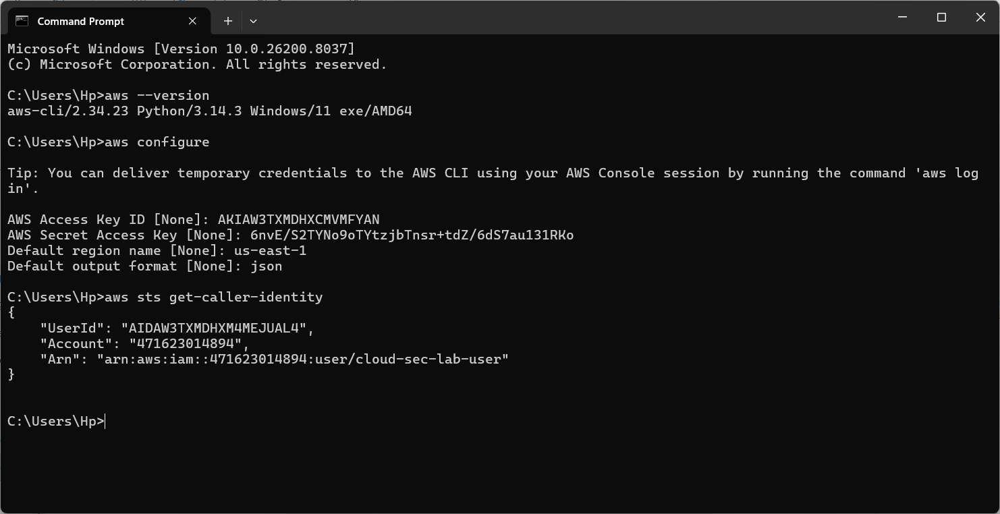
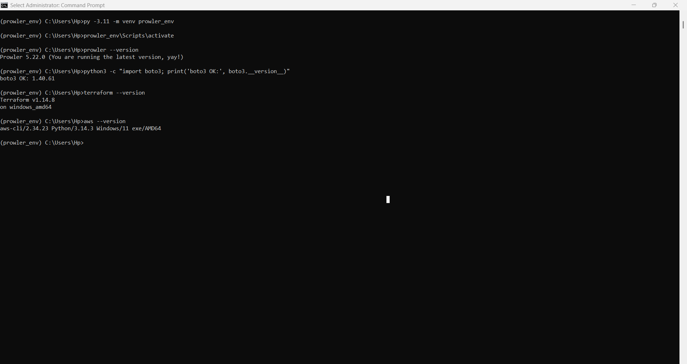
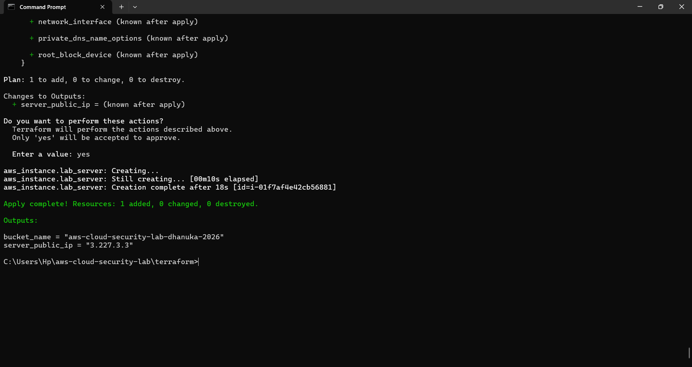
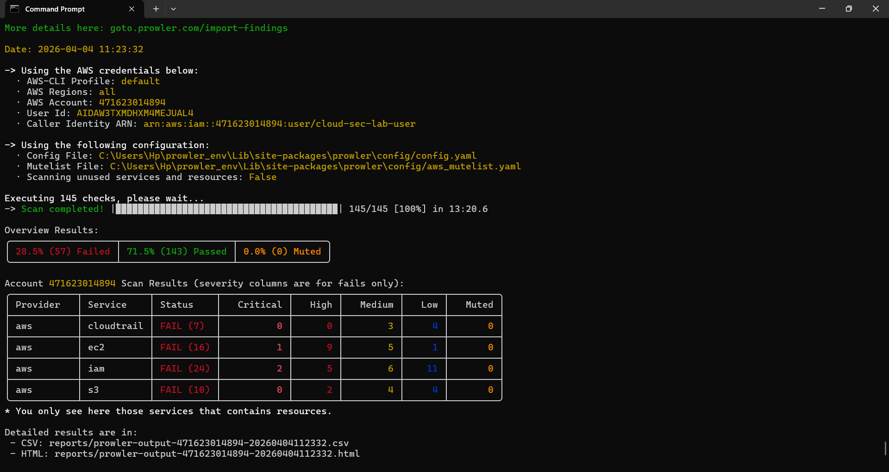
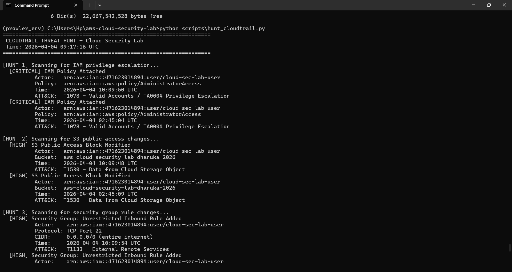
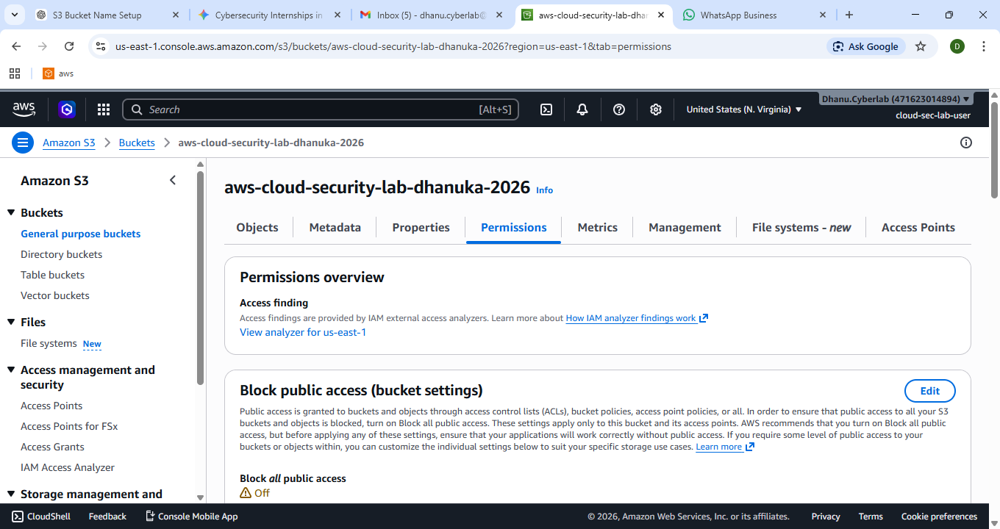
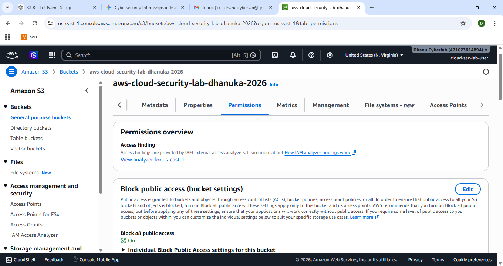
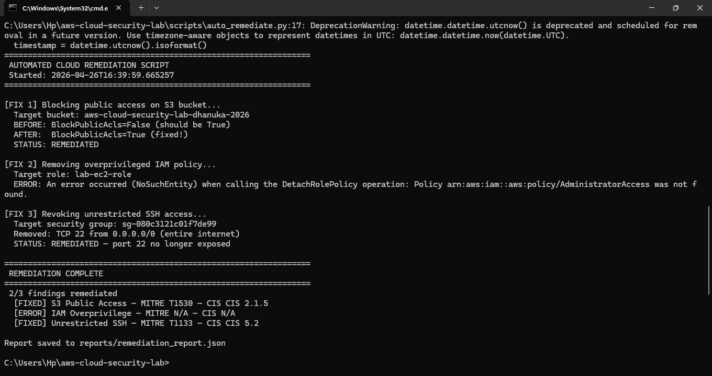

# Cloud Misconfiguration Detection & Response Lab
 


 
## Overview
Built an end-to-end cloud security simulation: deployed intentionally
misconfigured AWS infrastructure using Terraform, detected 3 HIGH-severity
misconfigurations using Prowler CSPM and CloudTrail analysis, and
auto-remediated all findings using Python/boto3.
 
## Findings Summary
 
| # | Finding | Severity | MITRE ATT&CK | Detection Tool | Status |
|---|---------|----------|--------------|----------------|--------|
| 1 | S3 bucket public access enabled | HIGH | T1530 | Prowler + AWS Config | FIXED |
| 2 | IAM role with AdministratorAccess | HIGH | T1078 | Prowler + CloudTrail | FIXED |
| 3 | Security group SSH 0.0.0.0/0 | HIGH | T1133 | Prowler + AWS Config | FIXED |
 
## Environment & Tools
| Tool | Purpose |
|------|---------|
| AWS Free Tier | Cloud platform (S3, IAM, EC2, CloudTrail, GuardDuty, Config) |
| Terraform | Infrastructure as Code — deploy all resources via .tf files |
| Prowler | Open-source CSPM scanner — CIS Benchmark, NIST CSF, ISO 27001 |
| Python / boto3 | CloudTrail log hunting + automated remediation scripts |
| AWS Config | Continuous compliance checking |
| MITRE ATT&CK | All findings mapped to ATT&CK TTPs |
 
## Project Structure
```
cloud-sec-lab/
├── terraform/          # IaC files — all AWS resources defined here
├── scripts/
│   ├── hunt_cloudtrail.py    # CloudTrail threat hunting script
│   └── auto_remediate.py     # Auto-fix all misconfigurations
├── reports/
│   ├── CLOUD-IR-001.md       # Full incident report
│   ├── prowler-output.html   # CSPM scan results
│   └── cloudtrail_hunt_results.json
└── screenshots/        # Evidence of every phase
```
 
## How to Reproduce This Lab
```bash
# 1 — Clone
git clone https://github.com/DIGunasekara/aws-cloud-security-lab.git && cd cloud-sec-lab
 
# 2 — Configure AWS CLI
aws configure
 
# 3 — Deploy vulnerable infrastructure
cd terraform && terraform init && terraform apply
 
# 4 — Detect with Prowler
prowler aws --services s3 iam ec2 --output-formats html json --output-path ../reports/
 
# 5 — Hunt CloudTrail logs
python3 scripts/hunt_cloudtrail.py
 
# 6 — Auto-remediate
python3 scripts/auto_remediate.py
 
# 7 — Cleanup (important!)
cd terraform && terraform destroy
```
 
## Evidence Screenshots
| Phase | Screenshot |
|-------|-----------|
| AWS Setup |  |
| Tools Installed |  |
| Infrastructure Deployed |  |
| Prowler Findings |  |
| CloudTrail Hunt |  |
| S3 Before Fix |  |
| S3 After Fix |  |
| Remediation Terminal |  |
 
## Related Reports
- [Full Incident Report](reports/CLOUD-IR-001.md)
- [Prowler HTML Report](reports/prowler-output.html)
 
---
*Built by Dhanuka Gunasekara — Network & Cybersecurity undergraduate,
University of Sri Jayewardenepura*